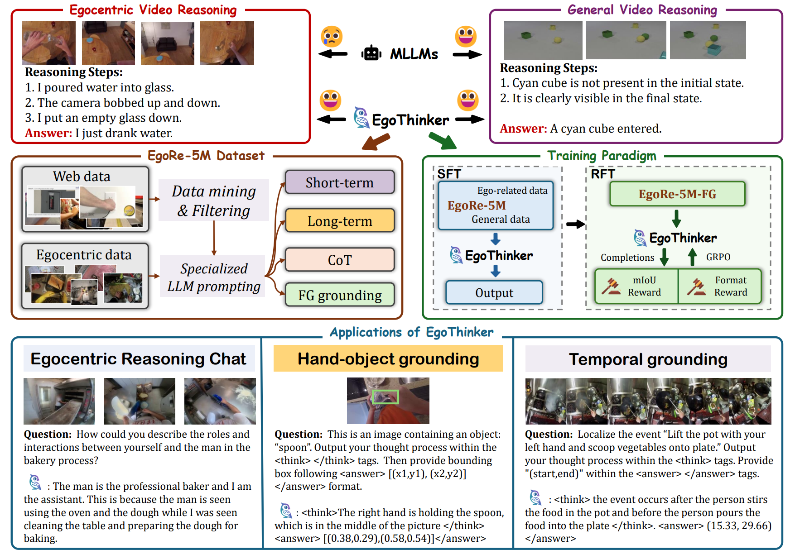

# EgoThinker

This repo is the official implementation of EgoThinker at NeurIPS 2025 (coming soon)

> **["Unveiling Egocentric Reasoning with
Spatio-Temporal CoT"](https://arxiv.org/abs/2510.23569)**<br>
> [Baoqi Pei](https://scholar.google.com/citations?user=sTCkd54AAAAJ), [Yifei Huang](https://scholar.google.com/citations?user=RU8gNcgAAAAJ), [Jilan Xu](https://scholar.google.com/citations?user=mf2U64IAAAAJ), Yuping He, [Guo Chen](https://scholar.google.com/citations?user=lRj3moAAAAAJ),<br> 
> [Fei Wu](https://scholar.google.com/citations?user=XJLn4MYAAAAJ),  [Yu Qiao](https://scholar.google.com/citations?user=gFtI-8QAAAAJ), [Jiangmiao Pang](https://scholar.google.com/citations?user=ssSfKpAAAAAJ&hl=zh-CN&oi=ao)<br>


<a href="https://github.com/InternRobotics/EgoThinker"></a> &nbsp;
<a href="https://github.com/InternRobotics/EgoThinker"></a> &nbsp;

⭐️: We are also working on a updated version for **spatial understanding** and **embodied QA**, stay tuned! 


---

### Introduction

Egocentric video reasoning focuses on the unseen, egocentric agent who shapes the scene, demanding inference of hidden intentions and fine-grained interactions—areas where current MLLMs struggle. We present EgoThinker, a framework that equips MLLMs with strong egocentric reasoning via spatio-temporal chain-of-thought supervision and a two-stage curriculum. We build EgoRe-5M, a large-scale QA dataset derived from 13M egocentric clips, featuring multi-minute segments with detailed rationales and dense hand–object grounding. Trained with SFT on EgoRe-5M and refined with RFT for better spatio-temporal localization, EgoThinker outperforms prior methods on multiple egocentric benchmarks and yields substantial gains in fine-grained localization tasks.

<div align="center">

</div> 


### 📰 News

- **`2025-10-28`**: We released our paper and code.

### 🛠️ Method

This repo contains three parts:

- [EgoThinker-SFT](https://github.com/InternRobotics/EgoThinker/tree/main/EgoThinker-SFT): SFT training code for EgoThinker.
- [EgoThinker-RFT](https://github.com/InternRobotics/EgoThinker/tree/main/EgoThinker-RFT): RFT training code for EgoThinker. 
- [lmms-eval](https://github.com/InternRobotics/EgoThinker/tree/main/lmms-eval): Evaluation code for egocentric and embodied QA benchmarks.

### 🤗 Feedback & Support

We welcome feedback and issues. Thank you for trying our EgoThinker!

### 📜 Citation

```bibtex
@misc{pei2025egothinkerunveilingegocentricreasoning,
      title={EgoThinker: Unveiling Egocentric Reasoning with Spatio-Temporal CoT}, 
      author={Baoqi Pei and Yifei Huang and Jilan Xu and Yuping He and Guo Chen and Fei Wu and Yu Qiao and Jiangmiao Pang},
      year={2025},
      eprint={2510.23569},
      archivePrefix={arXiv},
      primaryClass={cs.CV},
      url={https://arxiv.org/abs/2510.23569}, 
}
```

### 📄 Acknowledgments

Our code is built projects:

* **Qwen-VL** — [https://github.com/QwenLM/Qwen3-VL](https://github.com/QwenLM/Qwen3-VL)
* **VideoChat-R1** — [https://github.com/OpenGVLab/VideoChat-R1](https://github.com/OpenGVLab/VideoChat-R1)
* **lmms-eval** — [https://github.com/EvolvingLMMs-Lab/lmms-eval](https://github.com/EvolvingLMMs-Lab/lmms-eval)


---

